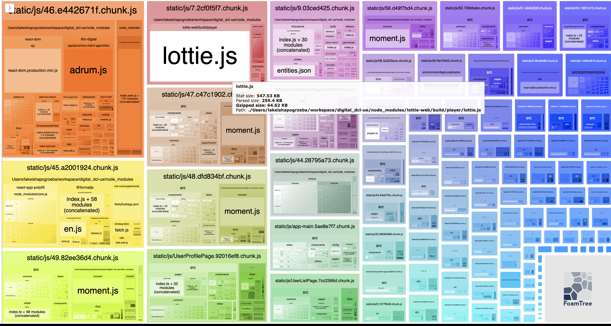
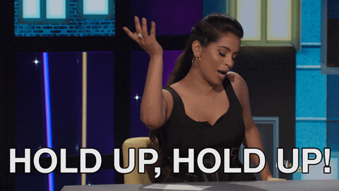

## Lottie Animation Campfire: 🔥 Analysis 🔥

So its all working pretty good eh? But what about the bundle size?



The important stat to note here is the `Gzipped`. Thats whats going to be the actual size by the time a client has to download it when they are using our application in the browser

64kb, thats really not too bad. Plus...

<br></br>
<br></br>
<br></br>
<br></br>


We are lazy loading our routes anyways, so this code only get downloaded when the user reaches the page that contains the animation

```jsx
const EditUserProducts = React.lazy(
  () =>
    import(
      /* webpackChunkName: "EditUserProductsPage" */ "../../pages/EditUserProducts"
    )
);
```
<br></br>
<br></br>
<br></br>
<br></br>


<br></br>
<br></br>
<br></br>
<br></br>

Wait, what about what you said before with the two animation files - how can we use just one?

<br></br>
<br></br>
<br></br>
<br></br>

What is a Marker?
> Marker is a way to represent a specific frame (or progress time) in Lottie animation by using a key name. You can imagine it as a pin on the map where you can use it to navigate to a specific location.

 When creating an animation, designers can mark playback points for developers to use without having to worry about keeping track of animation progress time or frames.

 ```jsx
 animationView.play(fromMarker: "touchDownStart",
                   toMarker: "touchDownEnd")
```


<br></br>
<br></br>
<br></br>
<br></br>

[next: Thank you](thankyou.md)

[previous: Problems](problems.md)

