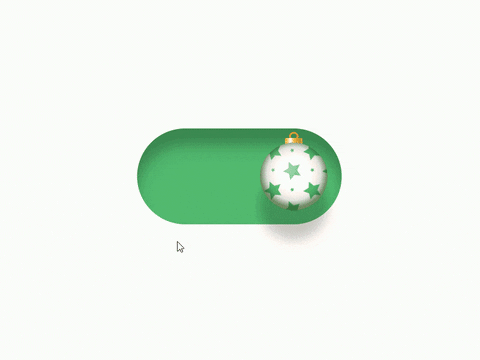

# Lottie Animation Campfire 🔥


## Dont want to read the docs? heres the TLDR

In this example we'll go over what i did to implement a Toggle for Edit Products page within User-Management

Obtain the json from you UI dev and copy it your your project. I created a folder for all our lotties.



import it into the component where you will use it. dont forget to `yarn add react-lottie` !!

```jsx
import Lottie from "react-lottie";
import animationDataOffToOn from "../../lotties/off-on_toggle.json";
import animationDataOnToOff from "../../lotties/on-off_toggle.json";
```


> With my first time creating a lottie animation, I actually used two animation files, one animation for each way that the toggle goes. We'll get into improvements on this later.

<br></br>
<br></br>
<br></br>
<br></br>

The Lottie needs to be configured. Lets create those config objects
```jsx

    const OffOptions = {
      loop: false,
      autoplay: false,
      animationData: animationDataOffToOn,
      rendererSettings: {},
    };
    const OnOptions = {
      loop: false,
      autoplay: false,
      animationData: animationDataOnToOff,
      rendererSettings: {},
    };
```

<br></br>
<br></br>
<br></br>
<br></br>

Now, since we are using two lotties, we will need some state to keep track of which one is currectly active

We will also need to use our `checked` prop to control changing that state
> the checked prop comes from the parent component(ex: the page that conatins the toggle) and tell the toggle component whether to be checked or not

```jsx
    import React, { useState, useEffect } from "react";


    ...


    const [isOffStopped, setIsOffStopped] = useState(true);
    const [isOnStopped, setIsOnStopped] = useState(true);


    ...


    useEffect(() => {
      setIsOffStopped(!checked);
      setIsOnStopped(checked);
    }, [checked]);

    ...


```


Now we can define lottie in our toggle component. 

We are still using a regular html `<input>` to act as the toggle ( code is within the `renderInput()` function), since the lottie animation is simply an animation and doesnt come with standard toggling ability.

We'd id rather stick to html elements for the functionality so that i dont need to worry about redoing all that an input does

So we render the `input` as hidden. We'll have to do a bit of hacking to make this work as you'll see.
```jsx
    ...


    const renderLottieToggle = () => {
      return (
        <div className={getClassName({ descendantName: "focusableContainer" })}>
          {renderInput()}
          {checked ? (
            <Lottie
              height={50}
              isStopped={isOffStopped}
              options={OffOptions}
              title={validSelectorId}
              width={50}
            />
          ) : (
            <Lottie
              height={50}
              isStopped={isOnStopped}
              options={OnOptions}
              title={validSelectorId}
              width={50}
            />
          )}
        </div>
      );
    };

    ...
 ```

note, we must set the size, since the animation by default was quite large. thankfully lottie gives us a prop to handle this so we dont need to get into the css.

<br></br>
<br></br>
<br></br>
<br></br>

<br></br>
<br></br>
<br></br>
<br></br>


# 💥


[next: Problems](problems.md)

[previous: Documentation](documentation.md)

