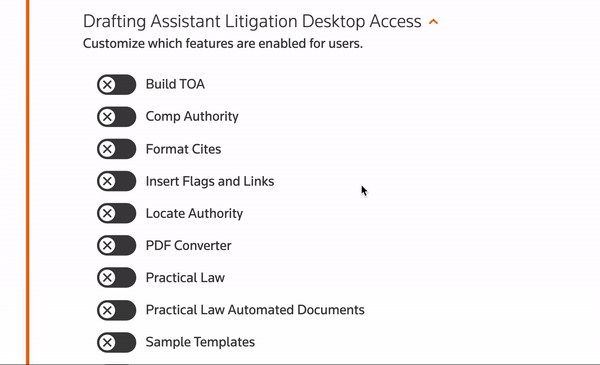
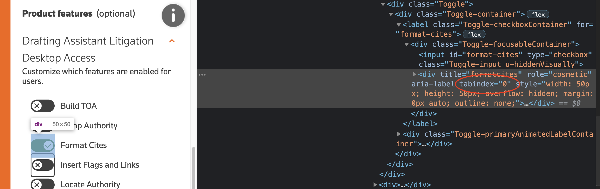
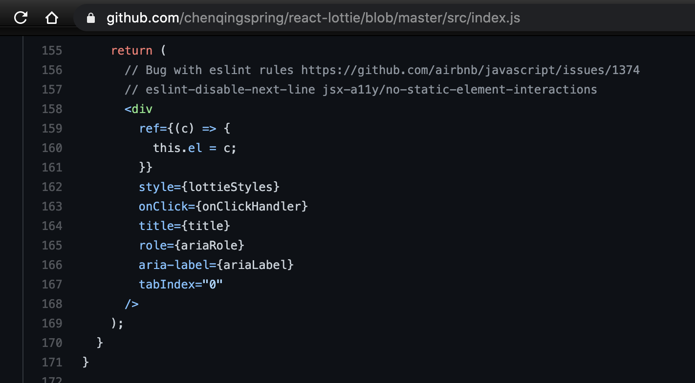
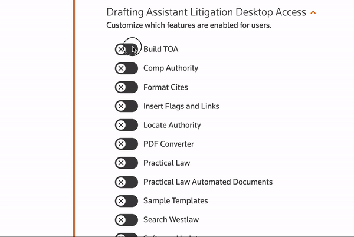

## Lottie Animation Campfire: 🔥 Problems 🔥


So the first problem i encountered was with accessibility. We need to be able to tab onto the toggle, and activate it with the spacebar, and get a border to indicate that the element is focused.

And when i first tried to do this...



<br></br>
<br></br>
<br></br>
So whats happening here? Lets open the dev console
<br></br>
<br></br>
<br></br>

<br></br>
<br></br>
<br></br>
Well, we have two nodes. Our input which does the work of actually being a toggle, and a div generated by react-lottie that contains everything that makes up the animation
But, it looks like the lottie div has a `tabindex=0` on it! oh no!
<br></br>
<br></br>
<br></br>
So I took a look at the source code
<br></br>
<br></br>
<br></br>


<br></br>
<br></br>
<br></br>
It would be nice if they exposed tabIndex as a prop, so that the developer can choose. But we need this working ASAP, so lets get hacking
<br></br>
<br></br>
<br></br>
Lets write a function to select the element directly with a query selector, and remove that tabIndex
```jsx
// https://github.com/chenqingspring/react-lottie/issues/130
export const removeTabIndexFromLottie = (selector: string) => {
  const lottieDiv = document.querySelector<HTMLElement>(selector);
  if (lottieDiv) {
    lottieDiv.tabIndex = -1;
  }
};
```

now lets call our function after the component renders to make the update

Here, we use the toggle title(which ends up being its ID) as a unique identifier to target it
```jsx
    useEffect(() => {
      if (useAnimation) {
        removeTabIndexFromLottie(
          `.Toggle-focusableContainer div[title=${validSelectorId as string}]`
        );
      }
    });
```

<br></br>
<br></br>
<br></br>
<br></br>
<br></br>
<br></br>


Now, one more small issue :)

We need that nice border around the element when its focused. The truth is, when our Toggle is selected, its actually the invisible `<input>` that is selected

So how do we apply a border to the sibling element, of the `<input>` that is focused?

<br></br>
<br></br>
<br></br>
<br></br>
<br></br>
<br></br>

Lets use CSS `+`!
> The element+element selector is used to select an element that is directly after another specific element.

```css
.Toggle input:focus + div[role="cosmetic"] {
  border: 2px solid var(--color-tr-gray-dark);
  border-radius: 5px;
}
```


<br></br>
<br></br>
<br></br>
<br></br>
<br></br>
<br></br>

# 💥


[next: Analysis](analysis.md)

[previous: Implementation](codeImplementation.md)

